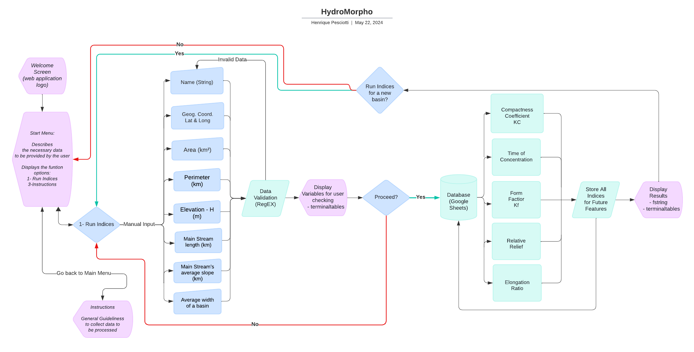
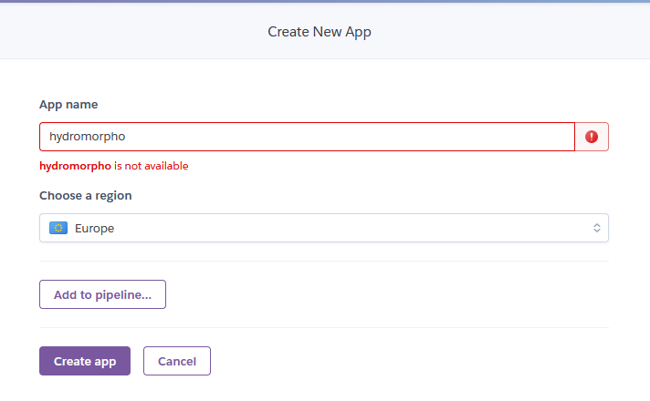
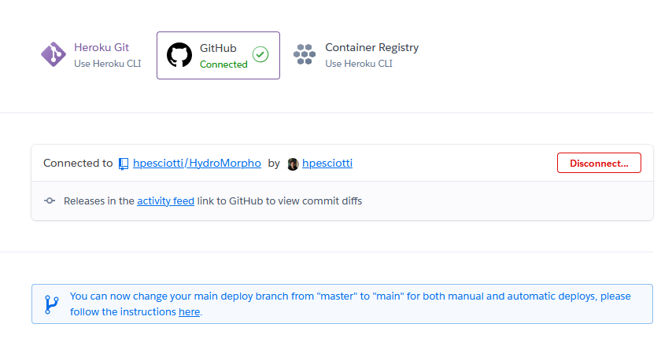
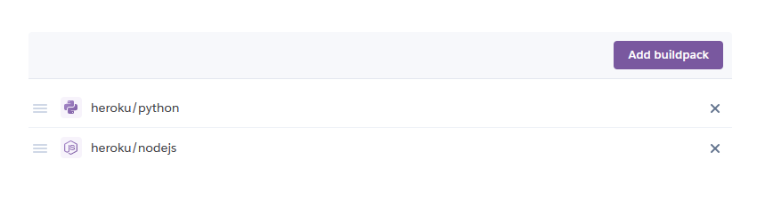
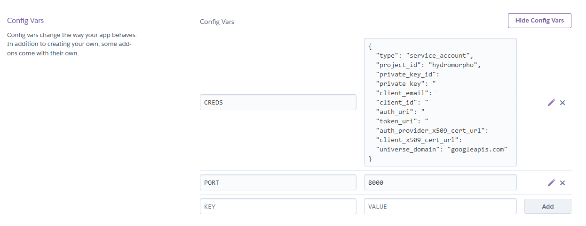
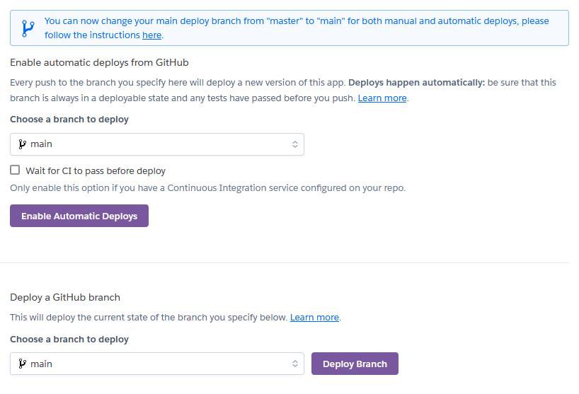

# HydroMorpho | a Morphometric Calculator


[Visit my Python command line interface (CLI) application here](https://hydromorpho-5915fcc16b8b.herokuapp.com/)

## CONTENTS  

1. [Introduction](#1-introduction)

2. [UX Design](#2-ux-design)

    2.1. [Strategy](#21-strategy)

    2.2. [User Stories](#22-user-stories)
    
    2.3. [Wireframes](#23-wireframes)

    2.4. [Design](#24-design)

3. [Features](#3-features)

    3.1. [Existing Features](#31-existing-features)

    3.2. [Future Features](#32-future-features)

4. [Technologies Used](#4-technologies-used)

    4.1. [Languages Used](#41-languages-used)

    4.2. [Frameworks, Libraries & Programs Used](#42---frameworks-libraries-technologies--programs-used)


5. [Deployment](#6-deployment)

    5.1. [Forking the Github Repository](#61-forking-the-github-repository)

    5.2. [Github Pages](#62-github-pages)

    5.3. [Making a Local Clone](#63-making-a-local-clone)

6. [Credits](#7-credits)


## **1. Introduction**

This Python command line interface (CLI) application is a morphometric calculator that offers numerical and textual insights about basins inputted by the user. The app, PP3 project of diploma in Full Stack Software Development by Code Institute, was designed to demonstrate proficiency with Python as a backend development and analytical tool. 

My choice for an unorthodox and quite unique project stems from my academic background in Geography (bachelor's degree) and my knowledge of Fluvial Geomorphology and Geographic Information Systems (GIS). Moreover, I intended to deviate from classical Python projects in order to develop my competencies in thinking about the logic of software without relying on tutorials or other students' projects. Thus, combining watershed assessing methodologies with the versatility of Python and its libraries seemed a worthy challenge.

[Back to top](https://github.com/hpesciotti/HydroMorpho/blob/main/README.md)

## **2. UX Design**

### **2.1. Strategy**

While designing the application, I searched the academic literature for morphometric indices that would be of great value in assessing a river's susceptibility to flooding events. The indices should present easily collected variables and do not require skills in numerical modelling or geographic information systems. Finally, an interpretation key for the indices generated would be necessary. 

Despite my experience with this subject, deciding on these indices proved arduous and time-consuming. In a way, this made the rest of the application development process relatively short. Therefore, the development of this CLI became a major challenge from the point of view of methodology and the programming language learning curve.

[Back to top](https://github.com/hpesciotti/HydroMorpho/blob/main/README.md)

### **2.2. User Stories**

- I want obtain morphometric data for a certain basin.
- I want a application that does not require proficiency in Geographic Information System - GIS, and I can type variables and obtain my results.
- I want to know if my basin is prone to flood events.
- I want quick and effective way to evalute hydrology a watershed.
- I want to consult the data of a submitted basin.

[Back to top](https://github.com/hpesciotti/HydroMorpho/blob/main/README.md)

### **2.3. Flow Chart**

I generated the preliminary CLI application flow chart utilizing Lucidcharts. The need for a detailed thought process to establish the foundational elements of features and application flow was very helpful during the coding stage. In a sense, the initial architecture given by the flow chart was strictly followed to the best of my coding capacities.



[Back to top](https://github.com/hpesciotti/HydroMorpho/blob/main/README.md)

### **2.4. Design**

#### **Imagery**

The site's background image was obtained through Adobe Firefly AI Image Generator application. The generative AI, based on a prompt indicating the colour palette, the illustration style, and the elements to be displayed, returned the [image](docs/documentation/background-image.png) present in the application. Furthermore, the image was compressed and convert to webp.

[Back to top](https://github.com/hpesciotti/HydroMorpho/blob/main/README.md)

#### **Colour Scheme**

The colour scheme chosen is inspired by hues found in nature but in more vivid tones. The colour # f7e2b7 designates the yellow of sand or dirt, the blue of lakes is represented by the colour #20596c, the green of forests is present in the colour #a4dbb1, and the blue of glaciers is represented through #daf5ec.


The selection of text and background took into consideration the contrast ratio of at least Level AA. [EightShape contrast grid](docs/documentation/contrast-grid.png) is present in the documentation. The white fonts with [drop-shadow](docs/documentation/drop-shadow-typography.png) present on the user name and leaderbord are not classified as AAA or AA, but the colour used on the drop-shadow effect are, highliting the letters from the background.

Moreover, regarding the drop shadow effect, I tried to get a score superior to 5 on Adobe Color.  The following chart displays some changes to the drop-shadow colours aiming for better readability.
- Drop-shadow  - chosen color


[Back to top](https://github.com/hpesciotti/HydroMorpho/blob/main/README.md)

#### **Typography**

The employed typography was Poppins provided by [Google Fonts](https://fonts.google.com/?query=poppins). I opt to use only one font on this web application in order to maintain uniformity. This choice was inspired by [Codehal's video tutorial](https://www.youtube.com/watch?v=Vp8x8-reqZA).

[Back to top](https://github.com/hpesciotti/HydroMorpho/blob/main/README.md)

## **3. Features**

### **3.1. Existing Features**

#### **Data Collection**

This page defines the guidelines and provides general instructions on how the quiz works. The user must enter a valid username in a text input area with a maximum length of 15 characters. The user entry is saved in local storage and will later be used in the leaderboard. The function to get the username was inspired by Amy Richardson's PP2 project. The username is also reproduced on the following page via inner.html

Once the user's name is entered, a function is called to randomly pull ten questions from the allQuestions variable, which is the database. The setGameQuestions function generates playable questions by selecting "n" questions from a question database stored in the variable "allQuestions". It utilizes a loop to iterate over the questions and pushes them into an array named "gameQuestions". The design of this function was influenced by the approach discussed in the following Stack Overflow post: [Push 3 random names into a new array](https://stackoverflow.com/questions/52763765/push-3-random-names-into-a-new-array).

Also, in the code sphere,  setQuestionsOptions sets the answer options for each question in the gameQuestions array by shuffling them. It employs the Durstenfeld shuffle algorithm, which efficiently randomizes the order of elements in an array. The implementation of this function draws inspiration from a thread on Stack Overflow regarding [How to randomize (shuffle) a JavaScript array.](https://stackoverflow.com/questions/2450954/how-to-randomize-shuffle-a-javascript-array)

At last, the presence of a back to main menu button ensures that users can navigate freely.

[Back to top](https://github.com/hpesciotti/HydroMorpho/blob/main/README.md)

### **Run Morphometric Indices**

**Compactness Coefficient**

The compactness coefficient (or Gravelius coefficient),  K_c , is defined as the ratio between the perimeter of a basin (P) and the perimeter of a circle with the same area (A). For a circular basin, the area and perimeter are given by  A = \pi r^2  and  P = 2\pi r , respectively. Thus, the compactness coefficient is calculated as:

\[ K_c = \frac{P}{2\sqrt{\pi A}} \]

This coefficient measures how closely the shape of a basin approximates a circle (Horton, 1945). When  K_c = 1 , the basin is perfectly circular. Values of  K_c  greater than 1 indicate a deviation from circularity. The coefficient is dimensionless and independent of the basin size, with a minimum value of 1 corresponding to a circular basin. Basins with  K_c  values near 1 are more prone to significant flooding. Typically,  K_c  values less than or equal to 1.13 represent generally rounded basins.

Where:
-  P  = perimeter of the watershed (km)
-  A  = area of the watershed (km²)

In summary:
-  1.00 - 1.25 : basins with a high propensity for large floods
-  1.25 - 1.50 : basins with a moderate tendency for large floods
-  > 1.50 : basins not prone to large floods

2. **Time of Concentration**

Témez’s formula, tested in American and Spanish basins, closely approximates reality and, along with Giandotti's formula, is widely used in Portugal. The formula is:

\[ t_c = \left(\frac{L}{i^{0.25}}\right)^{0.76} \]

Where:
-  t_c  = time of concentration (h)
-  L  = main stream length (km)
-  i  = average slope of the main stream

According to Pelaez (1978), this formula can be applied to urban basins if urban zones are dispersed rather than concentrated. Urbanization enhances surface flow, necessitating adjustments to the time of concentration. Témez proposed the following adjustment for urban basins:

\[ t_c' = \frac{t_c}{1 + 3 \cdot \sqrt{\mu} \cdot (2 - \mu)} \]

Where  t_c  (in hours) is the time of concentration for natural basins, and  \mu  (dimensionless) is the ratio of the impermeable area to the total area. This formula is valid for basins with an area less than 3000 km².

3. **Form Factor ( K_f )**

The form factor,  K_f , represents the ratio between the average width ( l ) and the length of a basin ( L_b ). The average width is defined as the ratio between the area ( A ) and the length of the basin. Thus,  K_f  is:

\[ K_f = \frac{A}{L_b^2} \]

A basin with a low form factor is less prone to floods than one with a higher form factor because elongated basins have a lower likelihood of intense rain over the entire area simultaneously. Therefore, the contributions of tributaries do not occur simultaneously, reducing the critical flow rate. The maximum value of  K_f  is 1, corresponding to a square basin.

According to Horton (1932), the form factor is a dimensionless ratio of the basin length squared to the basin area, often used to describe various basin shapes (Vittala et al., 2004; Yangchan et al., 2015). The value ranges are:

-  1.00 - 0.75 : prone to floods
-  0.75 - 0.50 : moderate tendency for floods
-  < 0.50 : not prone to floods

4. **Elongation Ratio ( R_e )**

The elongation ratio,  R_e , is the ratio of the diameter to the length of a circle with the same area as the catchment. It provides insight into the hydrological characteristics of a drainage basin. An elongated basin is less efficient at discharging runoff compared to a circular basin.  R_e  is calculated as:

\[ R_e = \frac{\text{Diameter}}{\text{Length}} \]

The categorization of elongation ratios is:

- Less than 0.5: more elongated
- 0.5 to 0.7: elongated
- 0.7 to 0.8: less elongated
- 0.8 to 0.9: oval

5. **Relative Relief ( R_r )**

Melton (1957) used the concepts of perimeter and watershed relief to calculate parameters such as relative relief, which measures the variation in altitude within a region relative to its local reference point. This metric is valuable as it accounts for the slopes and dynamic characteristics of the terrain, providing an understanding of the morphogenesis, or the processes shaping the region's landforms.


### **3.2. Future Features**

- I intend to add a consultation fuctionality so the user would be able to check all the basins evaluated.

- To use all the data from the basins as a library of watershed morphometric behaviour worldwide.

- To adjust the f'string at the end of the morphometrics to make it a comprehensive if elif concatenator of results. 

- Due to terminal limiting and confusing UI, an improved graphic interface.

[Back to top](https://github.com/hpesciotti/HydroMorpho/blob/main/README.md)

## **4. Technologies Used**

### **4.1. Languages Used**

- [HTML5](https://en.wikipedia.org/wiki/HTML5)

- [CSS3](https://en.wikipedia.org/wiki/Cascading_Style_Sheets)

- [Python](https://www.python.org/about/)

### **4.2 - Frameworks, Libraries, Technologies & Programs Used**  

- [Gitpod](https://www.gitpod.io): used form coding

- [GitHub](https://github.com/): to save and store all files for this web application 

- [Git](https://git-scm.com/): used for version control

- [Terminal Tables](https://pypi.org/project/terminaltables/): setting up terminal tables.

- [Regex](https://www.w3schools.com/python/python_regex.asp): for checking for pattern in strings.

- [Colorama](https://pypi.org/project/colorama/): for color and stylling the terminal entries.

- [Google Fonts](https://fonts.google.com/): font was imported from here 

- [Font Awesome](https://fontawesome.com/): icons and their associated kit were downloaded from here  

- [Lucidchart](https://www.lucidchart.com/pages/?): used to create flowchart

- [ChatGPT](https://chat.openai.com/):  for improving and making text content more engaging

- [Grammarly](https://app.grammarly.com): for spelling or grammatical inaccuracies in the text

- [Google Chrome Lighthouse](https://chromewebstore.google.com/detail/lighthouse/blipmdconlkpinefehnmjammfjpmpbjk): for auditing the performance of the web application

- [Code Institute Linter](https://pep8ci.herokuapp.com/#): for validating Python code according PEP 8

- [MS Paint](https://www.microsoft.com/en-us/windows/paint): for editing the captured screenshots

- [Google Sheets](https://docs.gspread.org/en/v6.0.0/): as a online database.

- [Google Cloud Platform](https://cloud.google.com/): provide connection to Google APIs

- [Heroku](https://dashboard.heroku.com/): for deploying the terminal application.

[Back to top](https://github.com/hpesciotti/HydroMorpho/blob/main/README.md)


## **6. Deployment**


### **6.1. Deploying via Heroku**

I. Through [Heroku](https://dashboard.heroku.com/) dashboarb a new app was created.
"New" > "Create new app"

II. Enter a name for the app and choose the Europe region.
<details>
<summary>Create New App</summary>



III. Next go to "Deploy" tab and then to "Deployment method" to authorize the connection to my GitHub account.
<details>
<summary>Connect to GitHub</summary>



IV. After succesfull connection, select main branch from "hydromorpho-app" repository.

V. And then, go to Settings tab.

VI. Add Node.js and Python buildpacks.
<details>
<summary>Add Buildpack</summary>



VII. Go to "Config Vars" and add as KEY "CREDS" and as VALUE the user credentials token
VIII. Add in the same section KEY as "PORT" and 8000 as VALUE.
<details>
<summary>KEY VALUE</summary>



IX. In the "Deploy" tab Manual deploy was chosen.
<details>
<summary>Deploy</summary>



[Back to top](https://github.com/hpesciotti/HydroMorpho/blob/main/README.md)

### **6.2. Forking the GitHub Repository**

By forking the GitHub repository you can make a copy of the original repository on your GitHub account. You can view and/or make changes to this copy, without affecting the original repository, by using the following steps:

I. Log in to GitHub.
II. Navigate to the main page of the GitHub Repository that you want to fork.
III. At the top right of the Repository, just below your profile picture, find the "Fork" button.
IV. You should now have a copy of the original repository in your GitHub account.
V. Changes made to the forked repository can be merged with the original repository via a pull request.

[Back to top](https://github.com/hpesciotti/HydroMorpho/blob/main/README.md)

### **6.3. Making a Local Clone**

By cloning a GitHub Repository, you can create a local copy on your computer of the remote repository. This allows you to make all of your edits locally, rather than directly in the source files of the origin repository, by using the following steps:

I. Log in to GitHub
II. Navigate to the main page of the GitHub Repository that you want to clone.
III. Above the list of files, click on the dropdown item called "Code".
IV. To clone the repository using HTTPS, copy the link under "HTTPS".
V. Open Git Bash.
VI. Change the current working directory to the location where you want the cloned directory to be made.
VII. Type `git clone`, and then paste the URL you copied in Step 4.

```
$ git clone https://github.com/hpesciotti/HydroMorpho.git
```

VIII. Finally, press Enter. Your local clone has now been created.

```
$ git clone https://github.com/hpesciotti/GeoQuiz
> Cloning into `CI-Clone`...
> remote: Counting objects: 10, done.
> remote: Compressing objects: 100% (8/8), done.
> remove: Total 10 (delta 1), reused 10 (delta 1)
> Unpacking objects: 100% (10/10), done.
```

Changes made on the local machine (cloned repository) can be pushed to the upstream repository directly if you have a write access for the repository. Otherwise, the changes made in the cloned repository are first pushed to the forked repository, and then a pull request is created.

[Click Here](https://docs.github.com/en/github/creating-cloning-and-archiving-repositories/cloning-a-repository-from-github/cloning-a-repository) for a more comprehensive guide on how to complete the above process.

[Back to top](https://github.com/hpesciotti/HydroMorpho/blob/main/README.md)

## **6. Credits**

### **6.1. Content**

- Code Institute - Love Sandwiches projects: for fetching and saving data in Google Sheets.

- [RegexTutorial](https://www.regextutorial.org/positive-and-negative-lookahead-assertions.php): readin material on negative and positive lookahead assertions

- [Partorjk](https://patorjk.com/software/taag/#p=display&f=Graffiti&t=Type%20Something%20): for ASCII logo.

- [W3Schools](https://www.w3schools.com/python/python_regex.asp): for Regex reading material.

- [Regex Calculator](https://regex101.com/): for testing and implementing Regex

- [Tech with Tim](https://www.youtube.com/watch?v=u51Zjlnui4Y&t=305s): for colorama use.

- [Stack Overflow](https://stackoverflow.com/questions/18632491/how-do-i-check-for-an-exact-word-or-phrase-in-a-string-in-python): help me to adopt Regex for validation.

- [Stack Overflow](https://stackoverflow.com/questions/52763765/push-3-random-names-into-a-new-array): helped me how to shuffle values of objects in an array.

- [Stack Overflow](https://stackoverflow.com/questions/33032803/android-chrome-website-icon-is-missing): helped me fix favicon android 192x192 missing.

- [Terminal Tables](https://pypi.org/project/terminaltables/): setting up terminal tables.

- [Aleksander Kisielewicz](https://github.com/alexkisielewicz/home-library-app/tree/main): for the html layout and readme structure.

- [Amy Richardson](https://github.com/amylour/BakeStock/blob/main): for colorama, a couple of functions and Readme structure.

[Back to top](https://github.com/hpesciotti/HydroMorpho/blob/main/README.md)

### **6.2. Media**

- [Font Awesome](https://fontawesome.com/): for the icons used in the footer of the application.

- [Partorjk](https://patorjk.com/software/taag/#p=display&f=Graffiti&t=Type%20Something%20): for ASCII logo.

### **6.2. References**

- Horton, R.E., 1945. Erosional development of streams and their drainage basins;
hydrophysical approach to quantitative mor- phology. Bull. Geol. Soc. Am. 56
(275–370), 1945.

- Lousada, S. A. N., Camacho R. F., Rodrigues, A. A. R., 2019. Hydrology, Water Resources and Enviroment.
1st ed. Universidade da Madeira.

- Melton, M.A., 1957. An analysis of the relations among elements of climate, surface
properties and geomorphology. Project NR 389- 042, technical report 11, Columbia
University.

- Shekar, P. R., Matthew, A., 2024. Morphometric analysis of watersheds: A comprehensive 
review of data sources, quality, and geospatial techniques. In: Watershed Ecology and the Environment 6 (2024) 13–25

### **6.3. Acknowlegements**

- My informal mentor and great friend, [Bruno Dias](https://github.com/brunoald/), for helping me to structure the project.

- My cohort facilitator, [Amy Richardson](https://github.com/amylour/amylour), for clarifying and enriching the course content. 

- My partner, Joana, for all the emotional support.

[Back to top](https://github.com/hpesciotti/HydroMorpho/blob/main/README.md)