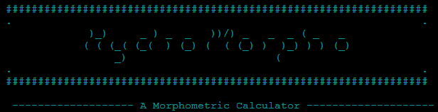

# HydroMorpho | a Morphometric Calculator

[Visit my Python command line interface (CLI) application here](https://hydromorpho-5915fcc16b8b.herokuapp.com/)

## CONTENTS  

1. [Introduction](#1-introduction)

2. [UX Design](#2-ux-design)

    2.1. [Strategy](#21-strategy)

    2.2. [User Stories](#22-user-stories)
    
    2.3. [Wireframes](#23-wireframes)

    2.4. [Design](#24-design)

3. [Features](#3-features)

    3.1. [Existing Features](#31-existing-features)

    3.2. [Future Features](#32-future-features)

4. [Technologies Used](#4-technologies-used)

    4.1. [Languages Used](#41-languages-used)

    4.2. [Frameworks, Libraries & Programs Used](#42---frameworks-libraries-technologies--programs-used)

5. [Deployment](#6-deployment)

    5.1. [Forking the Github Repository](#61-forking-the-github-repository)

    5.2. [Github Pages](#62-github-pages)

    5.3. [Making a Local Clone](#63-making-a-local-clone)

6. [Credits](#7-credits)

## **1. Introduction**

This Python command line interface (CLI) application is a morphometric calculator that offers numerical and textual insights about basins inputted by the user. The app, PP3 project of diploma in Full Stack Software Development by Code Institute, was designed to demonstrate proficiency with Python as a backend development and analytical tool. 

My choice for an unorthodox and quite unique project stems from my academic background in Geography (bachelor's degree) and my knowledge of Fluvial Geomorphology and Geographic Information Systems (GIS). Moreover, I intended to deviate from classical Python projects in order to develop my competencies in thinking about the logic of software without relying on tutorials or other students' projects. Thus, combining watershed assessing methodologies with the versatility of Python and its libraries seemed a worthy challenge.

[Back to top](https://github.com/hpesciotti/GeoQuiz?tab=readme-ov-file#geoquiz--a-geography-quiz-for-all-ages-and-backgrounds)

## **2. UX Design**

### **2.1. Strategy**

In the app's planning stage, I visited some websites with web applications that dealt with general geography issues, such as country capitals, landmarks, etc. However, I didn't find any of these quick quiz sites with more academically accurate content. So, I opted for a database of questions from the Brazilian vestibular exam (corresponding to the Irish leaving cert exam). I adapted most of the questions and inserted some others that would better portray Ireland's natural and geopolitical landscape. 

During my research, I came across websites that listed questions on a single page, which didn't align with the projects discussed in our weekly scrums. In one of these meetings, I shared my choice for PP2 with our cohort facilitator. She introduced us to the Geography for Kids project, a collaborative effort led by Deeksa Varma, which served as a valuable reference for our project. 

As a personal note, while analyzing the Geography for Kids project code, I noticed it was complex compared to the other app samples. Through a search on GitHub, I confirm that a person with a good background in the field developed it, which contrasts with my background of almost no coding experience before enrolling in Code Institute's course. The complexity ultimately led me to intensify my immersion in JavaScript and improve my skills.

The app is aimed at people of all ages and backgrounds, but it's best suited to people who have already completed elementary school. It also aims to create a ludic playful and colourful environment that introduces the user to the main themes of geography, such as Geopolitics, Climatology, Carthography, Landforms, and Biogeography. 

Responsibility is essential for the app as it allows users to access the quiz from various devices. Finally, the high score/leaderboard system gives greater engagement by generating competition between friends and potential users. 

[Back to top](https://github.com/hpesciotti/GeoQuiz?tab=readme-ov-file#geoquiz--a-geography-quiz-for-all-ages-and-backgrounds)

### **2.2. User Stories**

- I want obtain morphometric data for a certain basin.
- I want a application that does not require proficiency in Geographic Information System - GIS, and I can type variables and obtain my results.
- I want to know if my basin is prone to flood events.
- I want quick and effective way to evalute hydrology a watershed.
- I want to consult the data of a submitted basin.

[Back to top](https://github.com/hpesciotti/GeoQuiz?tab=readme-ov-file#geoquiz--a-geography-quiz-for-all-ages-and-backgrounds)

### **2.3. Flow Chart**

I generated the preliminary web application wireframes utilizing Balsamiq. I had yet to finalize the colour scheme at this stage of the project's conception. Therefore, I focused solely on establishing the foundational elements of features and web application flow.

In this sense, I have identified three essential stages for the app to meet the user stories requirements, which I have appointed as: 
- intro - "landing page" with the instructions and a form section to get the player name.
- game - the section of the game in which the questions and answer options would be displayed.
- score - showing how many questions were answered correctly and accompanied by a message that would reflect the score and an option to pay for the game again.

#### **Desktop/Laptop/Tablet Version**

-   [Intro](docs/documentation/wireframe-balsamic-geoquiz-intro-page-larger-screens.jpg)

-   [Game](docs/documentation/wireframe-balsamic-geoquiz-game-page-larger-screens.jpg)

-   [Score](docs/documentation/wireframe-balsamic-geoquiz-score-page-larger-screens.jpg)

#### **Mobile Version**

-   [Intro](docs/documentation/wireframe-balsamic-geoquiz-intro-page-mobile.jpg)

-   [Game](docs/documentation/wireframe-balsamic-geoquiz-game-page-mobile.jpg)

-   [Score](docs/documentation/wireframe-balsamic-geoquiz-score-page-mobile.jpg)

[Back to top](https://github.com/hpesciotti/GeoQuiz?tab=readme-ov-file#geoquiz--a-geography-quiz-for-all-ages-and-backgrounds)

### **2.4. Design**

#### **Imagery**

The site's background image was obtained through Adobe Firefly AI Image Generator application. The generative AI, based on a prompt indicating the colour palette, the illustration style, and the elements to be displayed, returned the [image](docs/documentation/background-image.png) present in the application. Furthermore, the image was compressed and convert to webp.

[Back to top](https://github.com/hpesciotti/GeoQuiz?tab=readme-ov-file#geoquiz--a-geography-quiz-for-all-ages-and-backgrounds)

#### **Colour Scheme**

The colour scheme chosen is inspired by hues found in nature but in more vivid tones. The colour # f7e2b7 designates the yellow of sand or dirt, the blue of lakes is represented by the colour #20596c, the green of forests is present in the colour #a4dbb1, and the blue of glaciers is represented through #daf5ec.

The selection of text and background took into consideration the contrast ratio of at least Level AA. [EightShape contrast grid](docs/documentation/contrast-grid.png) is present in the documentation. The white fonts with [drop-shadow](docs/documentation/drop-shadow-typography.png) present on the user name and leaderbord are not classified as AAA or AA, but the colour used on the drop-shadow effect are, highliting the letters from the background.

Moreover, regarding the drop shadow effect, I tried to get a score superior to 5 on Adobe Color.  The following chart displays some changes to the drop-shadow colours aiming for better readability.
- Drop-shadow  - chosen color

[Back to top](https://github.com/hpesciotti/GeoQuiz?tab=readme-ov-file#geoquiz--a-geography-quiz-for-all-ages-and-backgrounds)

#### **Typography**

The employed typography was Poppins provided by [Google Fonts](https://fonts.google.com/?query=poppins). I opt to use only one font on this web application in order to maintain uniformity. This choice was inspired by [Codehal's video tutorial](https://www.youtube.com/watch?v=Vp8x8-reqZA).

[Back to top](https://github.com/hpesciotti/GeoQuiz?tab=readme-ov-file#geoquiz--a-geography-quiz-for-all-ages-and-backgrounds)

## **3. Features**

### **3.1. Existing Features**

#### **Instructions/Username**

This page defines the guidelines and provides general instructions on how the quiz works. The user must enter a valid username in a text input area with a maximum length of 15 characters. The user entry is saved in local storage and will later be used in the leaderboard. The function to get the username was inspired by Amy Richardson's PP2 project. The username is also reproduced on the following page via inner.html

Once the user's name is entered, a function is called to randomly pull ten questions from the allQuestions variable, which is the database. The setGameQuestions function generates playable questions by selecting "n" questions from a question database stored in the variable "allQuestions". It utilizes a loop to iterate over the questions and pushes them into an array named "gameQuestions". The design of this function was influenced by the approach discussed in the following Stack Overflow post: [Push 3 random names into a new array](https://stackoverflow.com/questions/52763765/push-3-random-names-into-a-new-array).

Also, in the code sphere,  setQuestionsOptions sets the answer options for each question in the gameQuestions array by shuffling them. It employs the Durstenfeld shuffle algorithm, which efficiently randomizes the order of elements in an array. The implementation of this function draws inspiration from a thread on Stack Overflow regarding [How to randomize (shuffle) a JavaScript array.](https://stackoverflow.com/questions/2450954/how-to-randomize-shuffle-a-javascript-array)

At last, the presence of a back to main menu button ensures that users can navigate freely.

[Back to top](https://github.com/hpesciotti/GeoQuiz?tab=readme-ov-file#geoquiz--a-geography-quiz-for-all-ages-and-backgrounds)

### **3.2. Future Features**

- I intend to add a consultation fuctionality so the user would be able to check all the basins evaluated.

- To use all the data from the basins as a library of watershed morphometric behaviour worldwide.

- To adjust the f'string at the end of the morphometrics to make it a comprehensive if elif concatenator of results. 

- Due to terminal limiting and confusing UI, an improved graphic interface.

[Back to top](https://github.com/hpesciotti/GeoQuiz?tab=readme-ov-file#geoquiz--a-geography-quiz-for-all-ages-and-backgrounds)

## **4. Technologies Used**

### **4.1. Languages Used**

- [HTML5](https://en.wikipedia.org/wiki/HTML5)

- [CSS3](https://en.wikipedia.org/wiki/Cascading_Style_Sheets)

- [Python](https://www.python.org/about/)

### **4.2 - Frameworks, Libraries, Technologies & Programs Used**  

- [Gitpod](https://www.gitpod.io): used form coding

- [GitHub](https://github.com/): to save and store all files for this web application 

- [Git](https://git-scm.com/): used for version control

- [Terminal Tables](https://pypi.org/project/terminaltables/): setting up terminal tables.

- [Regex](https://www.w3schools.com/python/python_regex.asp): for checking for pattern in strings.

- [Colorama](https://pypi.org/project/colorama/): for color and stylling the terminal entries.

- [Google Fonts](https://fonts.google.com/): font was imported from here 

- [Font Awesome](https://fontawesome.com/): icons and their associated kit were downloaded from here  

- [Lucidchart](https://www.lucidchart.com/pages/?): used to create flowchart

- [ChatGPT](https://chat.openai.com/):  for improving and making text content more engaging

- [Grammarly](https://app.grammarly.com): for spelling or grammatical inaccuracies in the text

- [Google Chrome Lighthouse](https://chromewebstore.google.com/detail/lighthouse/blipmdconlkpinefehnmjammfjpmpbjk): for auditing the performance of the web application

- [Code Institute Linter](https://pep8ci.herokuapp.com/#): for validating Python code according PEP 8

- [MS Paint](https://www.microsoft.com/en-us/windows/paint): for editing the captured screenshots

- [Google Sheets](https://docs.gspread.org/en/v6.0.0/): as a online database.

- [Google Cloud Platform](https://cloud.google.com/): provide connection to Google APIs

- [Heroku](https://dashboard.heroku.com/): for deploying the terminal application.

[Back to top](https://github.com/hpesciotti/GeoQuiz?tab=readme-ov-file#geoquiz--a-geography-quiz-for-all-ages-and-backgrounds)

## **6. Deployment**

### **6.1. GitHub Pages**

### **6.2. Forking the GitHub Repository**

### **6.3. Making a Local Clone**

## **6. Credits**

### **6.1. Content**

- Code Institute - Love Sandwiches projects: for fetching and saving data in Google Sheets.

- [RegexTutorial](https://www.regextutorial.org/positive-and-negative-lookahead-assertions.php): readin material on negative and positive lookahead assertions

- [Partorjk](https://patorjk.com/software/taag/#p=display&f=Graffiti&t=Type%20Something%20): for ASCII logo.

- [W3Schools](https://www.w3schools.com/python/python_regex.asp): for Regex reading material.

- [Regex Calculator](https://regex101.com/): for testing and implementing Regex

- [Tech with Tim](https://www.youtube.com/watch?v=u51Zjlnui4Y&t=305s): for colorama use.

- [Stack Overflow](https://stackoverflow.com/questions/18632491/how-do-i-check-for-an-exact-word-or-phrase-in-a-string-in-python): help me to adopt Regex for validation.

- [Stack Overflow](https://stackoverflow.com/questions/52763765/push-3-random-names-into-a-new-array): helped me how to shuffle values of objects in an array.

- [Stack Overflow](https://stackoverflow.com/questions/33032803/android-chrome-website-icon-is-missing): helped me fix favicon android 192x192 missing.

- [Terminal Tables](https://pypi.org/project/terminaltables/): setting up terminal tables.

- [Aleksander Kisielewicz](https://github.com/alexkisielewicz/home-library-app/tree/main): for the html layout and readme structure.

- [Amy Richardson](https://github.com/amylour/BakeStock/blob/main): for colorama, a couple of functions and Readme structure.

[Back to top](https://github.com/hpesciotti/GeoQuiz?tab=readme-ov-file#geoquiz--a-geography-quiz-for-all-ages-and-backgrounds)

### **6.2. Media**

- [Font Awesome](https://fontawesome.com/): for the icons used in the footer of the application.

- [Partorjk](https://patorjk.com/software/taag/#p=display&f=Graffiti&t=Type%20Something%20): for ASCII logo.

### **6.2. References**

- Horton, R.E., 1945. Erosional development of streams and their drainage basins;
hydrophysical approach to quantitative mor- phology. Bull. Geol. Soc. Am. 56
(275–370), 1945.

- Lousada, S. A. N., Camacho R. F., Rodrigues, A. A. R., 2019. Hydrology, Water Resources and Enviroment.
1st ed. Universidade da Madeira.

- Melton, M.A., 1957. An analysis of the relations among elements of climate, surface
properties and geomorphology. Project NR 389- 042, technical report 11, Columbia
University.

- Shekar, P. R., Matthew, A., 2024. Morphometric analysis of watersheds: A comprehensive 
review of data sources, quality, and geospatial techniques. In: Watershed Ecology and the Environment 6 (2024) 13–25

### **6.3. Acknowlegements**

- My informal mentor and great friend, [Bruno Dias](https://github.com/brunoald/), for helping me to structure the project.

- My cohort facilitator, [Amy Richardson](https://github.com/amylour/amylour), for clarifying and enriching the course content. 

- My partner, Joana, for all the emotional support.

[Back to top](https://github.com/hpesciotti/GeoQuiz?tab=readme-ov-file#geoquiz--a-geography-quiz-for-all-ages-and-backgrounds)