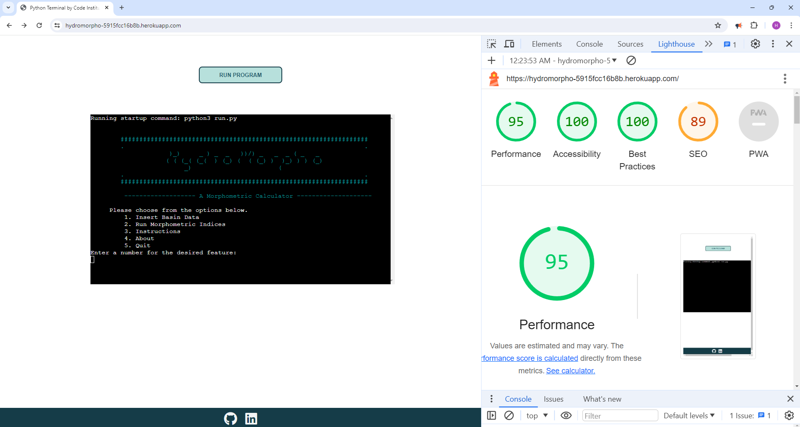
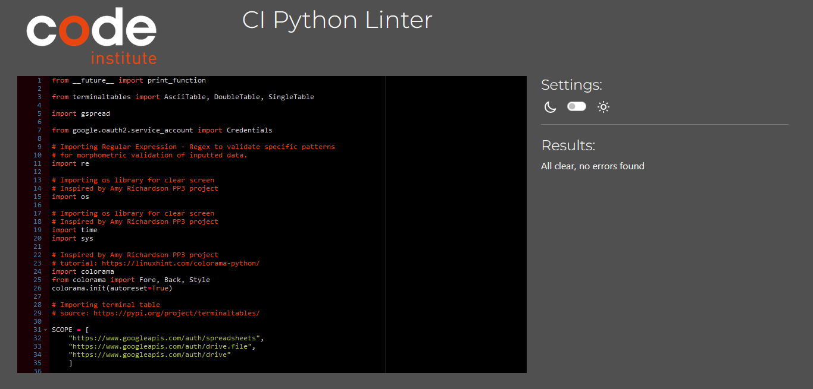
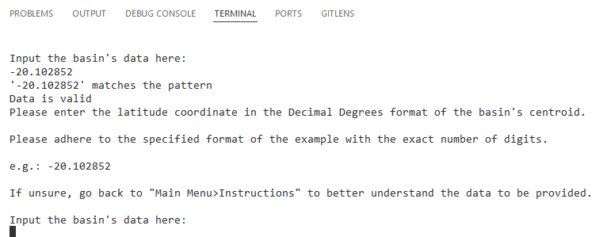
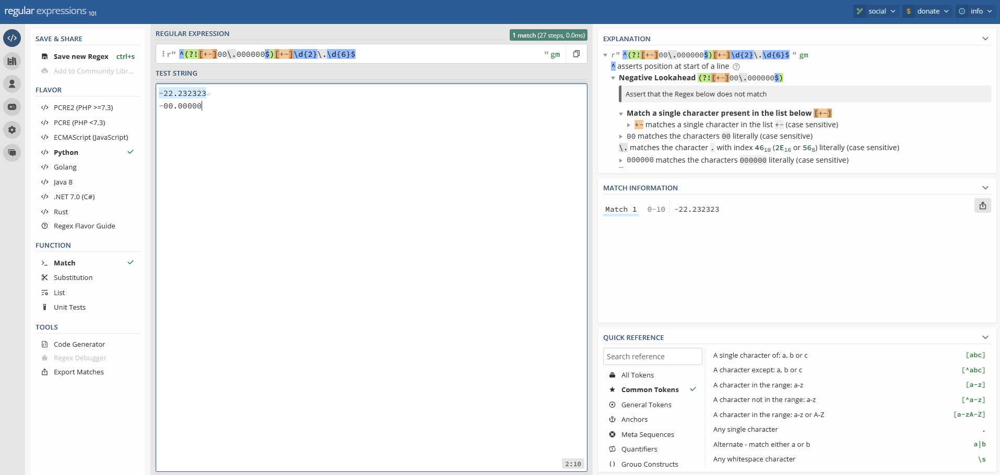
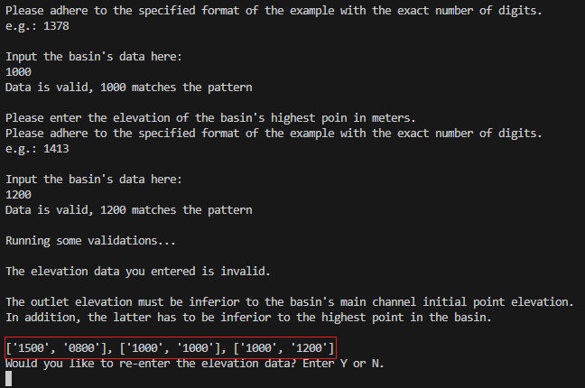
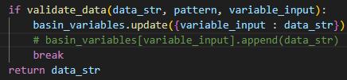
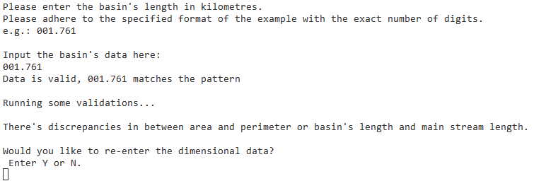
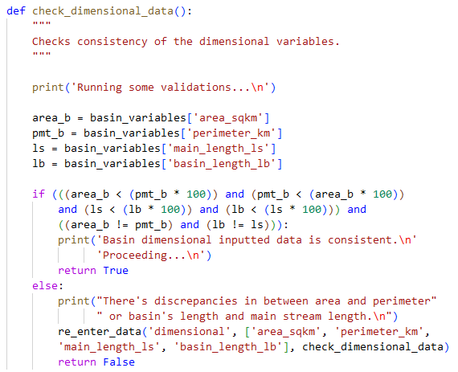
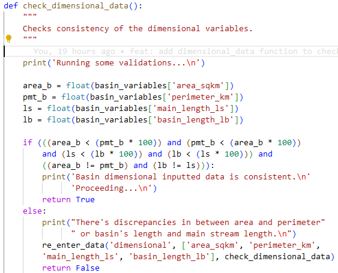

# HydroMorpho | a Morphometric Calculator

[Visit my Python command line interface (CLI) application here](https://hydromorpho-5915fcc16b8b.herokuapp.com/)

### **5.1. Testing**

#### **Performance Lighthouse**

The main page got a good performance index in  desktop versions according to the Lighthouse Validator. The following image shows the score in the performance register by Google's Chrome validator. 

Lighthouse Validator

##### **Code Institute Python PEP 8 Linter**
No major error was detected, aside from indentation and whitespaces. After some refactoring the Python Linter didn't encoutered any erros. 

Python Linter

### **5.4. Manual Testing**
According to the functions written in the code, these are the input possibilities for satisfying error handling and RegEx requirements. 

| Input Field                    | Example         | Possible Values                                                                                 | Type of input                                                                                |
|--------------------------------|-----------------|------------------------------------------------------------------------------------------------|-----------------------------------------------------------------------------------------------|
| Basin Name                     | b_river_suir_02 | Any string in the format 'b_xxxx_'                                                    	     | String ReGex format limited to 25 characteres                                                              |
| Latitude                       | -20.102852      | Any valid latitude in decimal format                                                            | String ReGex starting with -+ != 0                                                                     |
| Longitude                      | -43.453612      | Any valid longitude in decimal format                                                           | String ReGex starting with -+ != 0                                                                    |
| Area                           | 002.708         | Any positive decimal number                                                                     | String ReGex with 6 digits separated by a dot != 0                                                                          |
| Perimeter                      | 007.289         | Any positive decimal number                                                                     | String ReGex with 6 digits separated by a dot != 0                                                                       |
| Main Course Length             | 001.612         | Any positive decimal number                                                                     | String ReGex with 6 digits separated by a dot != 0                                                                     |
| Basin Length                   | 001.761         | Any positive decimal number                                                                     | String ReGex with 6 digits separated by a dot != 0                                                                           |
| Elevation Outlet               | 0961            | Any positive integer                                                                            | String ReGex with 4 digits separated != 0                                                                 |
| Elevation Spring               | 1378            | Any positive integer                                                                            | String ReGex with 4 digits separated != 0                                                    |
| Elevation Highest              | 1413            | Any positive integer                                                                            | String ReGex with 4 digits separated != 0                                                    |
| Urbanization Level             | 0.64            | Any decimal number between  0 and 1                                                              | Any decimal number between != 0 to 1                                                                            |
| Basin index			 | 2		   | Any string in the format 'b_river_suir_XX'                                                      | Any digit from 2 to 983 (Google Sheets limit)                                                                    |                                                                                   |
| General Information Print Option | b_river_suir_02 | Any string in the format 'b_river_suir_XX'                                                      | Basin name to print general information                                                       |
| Exit Option                    | 'exit'            | 'exit'                                                                                         | exit lowercase                                                                  |
| Confirmation (Yes/No)          | 'y', 'n'           | 'y', 'n'                                                                                       |String y or n lowercase

It should be noted that throughout the development and testing process we tried to insert a series of different values that would be either accepted or rejected. In addition, I tested the dimensional data validation functions and explored the choice loops in order to check for a break. Therefore, with a reasonable number of tests, I did not identify an error in the data entry. 

### **5.3. Bugs & Fixes** 

##### **Bug 01**

Bug: The get_data(dictionary RE_PATTERNS) function gets the Regex expression and returns the first identical value. 
This was an issue because the same Regex patterns were shared with different variables, i.e. Latitude and Longitude.
So even when the Longitude variable was called, the print strings of lat would show up because it was the first identical value in the dictionary.

Bug 01

Solution: Refactor the code with two dictionaries so the Regex values and variables intro texts are passed correctly.

##### **Bug 02**

Bug: Although the data entries were valid according to Regex string validation, the inputted data could be inconsistent with real-world data.
Thus, I tried to implement safeguards, such as not allowing the 0 entries, which would make the morphometric indeces invalid. 
Most of them are structured by multiplication and division operations, and allowing 0 as an entry would result in indices resulting in 0.

Bug 02

Solution: In this case, I added negative lookahead assertions along with the positive ones (validate the entry type). The first prevents the use of 0 as an entry.
I used Regex Tutorial as a consult material regarding negative and positive lookahead assertions. 
Regex negative and positive lookahead assertions: https://www.regextutorial.org/positive-and-negative-lookahead-assertions.php

##### **Bug 03**

Bug: The structure of get_data(variable_input) was set to append values to the basin dictionary after the input.
Because of the append action would add a value to the existent value of the parameter key, creating a list.
Thus, the validation check functions wouldn't evaluate a True after a False due to the incorrect values in the list.
In addition, adding values and creating a list would render the basin dictionary useless as a primary agroupment of temporary data.

Bug 03

Solution: The solution revolved around changing the way data is collected so that the old value would be replaced by a new one.
The possibility to replace data made it possible to run the application correctly, and this was done by updating the input rather than appending the value.
Hence, changing the last part of the snippet where inputs were passed to the basin dict fixed the bug.

Bug 03

##### **Bug 04**

bug: After re-entering invalid data more than twice, activating the loop between check_elevation and re_enter_data, even if the entries were validated between themselves
the re-enter variables loop would continue popping the re-enter elevation decision.

Bug 04

Solution: The bug was solved closing the outer loop of the re_enter_data function. This Stack Overflow's link help me with the solution.
https://stackoverflow.com/questions/65747924/break-doesnt-break-while-loop-why

##### **Bug 05**

Bug: The check_dimensional_data function wasn't returning properly True if inputs would numerically return true. 

Bug 05

Solution: By debugging and separating all the conditions, I noticed the bug was connected to the data type.
The data used in the function was a string. When this string was multiplied, it returned a new string instead of a number, leading to the incorrect output. 
So, I added the proper data type to the local variables (float or int).

Bug 05

##### **Bug 06**

Bug: When deploying the app to heroku it returned with the critical error: 
Traceback (most recent call last):   File "/app/run.py", line 10, in <module> from terminaltables import AsciiTable, DoubleTable, SingleTable ModuleNotFoundError: No module named 'terminaltables'.

Solution: I indetify the issues was connected to terminaltables and searched online using the terminal message.
I got a answer in https://github.com/LionSec/xerosploit/issues/102, and re-instal terminaltables and a couple other extensions, changing the python version to current.
I pushed my code and re-deployed the app in heroku and those measures solved my bug. 

##### **Bug 07**

Bug: To validate the basin index (Google Sheets index column of the data entered by the user) that connects steps 1 - Data Entry and 2 - Calculate Morphometric Indices, I chose to validate that input is an integer. However, high numbers (> 983) return the error "gspread.exceptions.APIError: APIError: [400]: Range (v_data!A999) exceeds grid limits. Max rows: 983, max columns: 26" and the regex check on column 1 basin_name returned the error TypeError: expected string or bytes-like object, got 'NoneType'

Solution: Thus, I created an if instance that only made valid values less than the Google Sheets limit of 983 rows. In addition, the entry 'NoneType' in the empty cell in column 1 was passed by the string method, which made it possible to check the data via regex.

### **5.4. Unsolved Bugs** 

Maybe it's not a bug, but depending on the size of the strings fetched in the print_morpho_text() function, they can break the justified look of the text. I've tried adjusting the spacing a few times, but the limitations of indentation and 79 characters have made this a difficult task. Apart from that, no other bug was detected during my testing. 